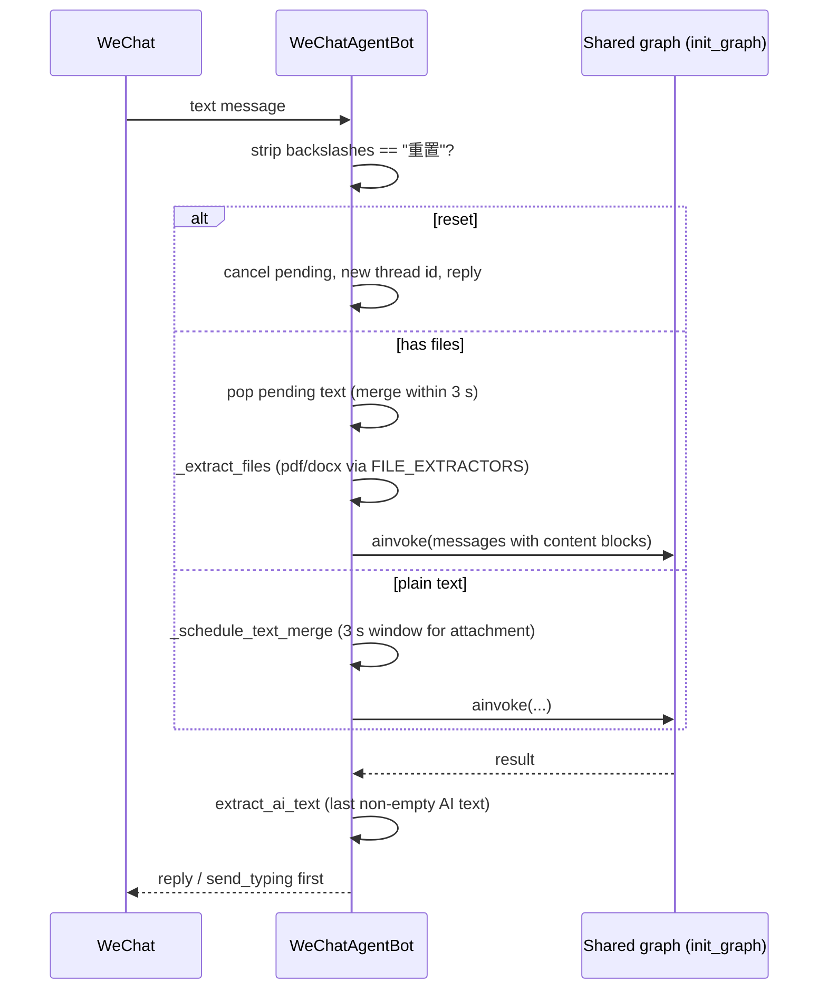

# WeChat Bot

Entry: `python backend/wechat_bot.py` (uses the `wechatbot-sdk` package). It builds its own `init_graph()` instance (separate process from the web backend — it does not call the FastAPI app) and logs in with a QR code.

## Lifecycle — `backend/wechat_bot.py`

1. `setup_logging()` + `langfuse_init()` at module import.
2. `_build_bot()`: creates `WeChatBot(on_qr_url, on_scanned, on_error)`. The QR code image is written to `UPLOADS_DIR/qr_code.png` and auto-opened; `on_error` ignores `TimeoutError` (normal long-poll timeout) and logs others.
3. Credentials: `~/.wechatbot/credentials.json`; if younger than 24 h, skip the QR (`login(force=False)`), otherwise force re-scan.
4. `run()`: registers `on_message` → `_handle_message`, starts long polling.

## Message handling

*WeChat message flow: per-user threads, a 3-second merge window for text-then-attachment messages, and full agent capability via the shared graph.*

- **Thread isolation**: `_threads[user_id] = uuid4().hex` created on demand — every WeChat user gets an independent conversation thread.
- **Text + attachment merge**: when a text message arrives, `_schedule_text_merge` buffers it for `MERGE_TIMEOUT = 3.0` s; if an attachment arrives within the window the pair is merged into one agent call; on timeout the text is processed alone.
- **Attachments**: downloads via `bot.download(msg)`, extracts `.pdf` (BytesIO → pdfplumber) / `.docx` (MarkItDown), writes extracted text to `UPLOADS_DIR/<name>.md`, and passes `[附件 N: name]` content blocks into the graph.
- **Reset command**: the text `重置` (backslashes stripped, since the SDK may escape them) cancels pending merges, assigns a fresh thread id, and replies.
- **Observability**: `build_langfuse_config(thread_id, tags=["wechat-bot"])` — shares the Langfuse project with the web backend.
- Errors during agent invocation reply with a fixed apology string and log the exception.

## Related pages

- [Backend overview](overview.md) — shared graph assembly
- [Chat flow](chat-flow.md) — content-block construction and file extraction
- [Operations](../operations.md) — run command
